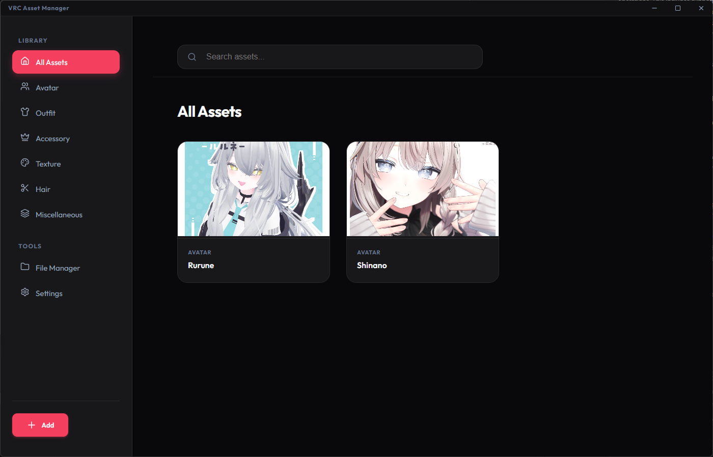

# VRC Asset Manager

A streamlined desktop application for effortlessly managing your VRChat avatars and organizing your asset library.



## Features

- **Asset Organization**: Categorize and view your VRChat assets with a clean, intuitive interface.
- **File Manager**: Track and open your local asset files and directories with ease.
- **Fast & Lightweight**: Built with Electron, React, and Vite for a smooth experience.

## Getting Started

### Installation

1. Go to the [Releases](https://github.com/asna-1st/VRC-Asset-Manager/releases) page.
2. Download the latest version
3. Run executable to get started.

## Development

If you wish to run from source:

1. Clone the repository:
   ```bash
   git clone hhttps://github.com/asna-1st/VRC-Asset-Manager.git
   cd vrc-asset-manager
   ```

2. Install dependencies:
   ```bash
   pnpm install
   ```

3. Run development mode:
   ```bash
   pnpm dev
   ```

This will start the Vite dev server for the React frontend and launch Electron.